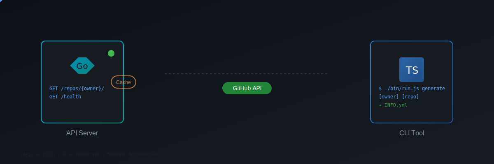

<p align="center">
  
</p>
<h1 align="center"><i>dotProject</i></h1>

<p align="center">
  <a href="https://golang.org"></a>
  <a href="https://www.typescriptlang.org"></a>
  <a href="https://nodejs.org"></a>
  <a href="https://github.com"></a>
</p>

## Overview

A monorepo tool for programmatically generating project information. It combines a Go API server that interfaces with GitHub's API to fetch repository data and a TypeScript CLI for generating INFO.yml files from that data.

## Features

- **Go API Server**: REST API that fetches GitHub repository data with built-in caching
- **TypeScript CLI**: Command-line tool built with oclif for generating INFO.yml files
- **GitHub Integration**: Direct interface with GitHub API for repository information
- **Caching Layer**: In-memory caching to reduce API calls and improve performance
- **Monorepo Structure**: Clean separation between API and CLI components

## Tech Stack

### API (Go)
- **Chi** - HTTP router
- **go-github** - GitHub API client
- **go-cache** - In-memory caching
- **Viper** - Configuration management

### CLI (TypeScript)
- **oclif** - Open CLI Framework
- **TypeScript** - Type-safe JavaScript
- **ESLint** - Code linting
- **Mocha/Chai** - Testing framework

## Requirements

- Go 1.24.3 or higher
- Node.js 21.0.0 or higher
- GitHub personal access token

## Installation

1. Clone the repository:
```bash
git clone https://github.com/nostromos/dotprojectv2.git
cd dotprojectv2
```

2. Install CLI dependencies:
```bash
cd cli
npm install
cd ..
```

3. Install API dependencies:
```bash
cd api
go mod download
cd ..
```

4. Set up your GitHub token:
```bash
export GITHUB_TOKEN=your_github_token
```

## Usage

### Starting the API Server

```bash
cd api
go run cmd/server/main.go
```

The API server will start on `http://127.0.0.1:8080`

### Using the CLI

Generate an INFO.yml file for a repository:

```bash
cd cli
./bin/run.js generate [owner] [repo]
```

### API Endpoints

- `GET /repos/{owner}/` - Fetch all repositories for a GitHub user
- `GET /health` - Health check endpoint

## Project Structure

```
dotprojectv2/
├── api/                      # Go API server
│   ├── cmd/
│   │   └── server/
│   │       └── main.go      # API entry point
│   ├── internal/
│   │   ├── cache/           # In-memory caching
│   │   ├── github/          # GitHub API client
│   │   ├── handlers/        # HTTP request handlers
│   │   └── setup/           # Environment setup
│   ├── go.mod
│   └── go.sum
├── cli/                      # TypeScript CLI
│   ├── src/
│   │   └── commands/
│   │       └── generate/    # Generate command
│   ├── bin/
│   │   └── run.js          # CLI entry point
│   ├── package.json
│   └── tsconfig.json
├── go.work                  # Go workspace configuration
└── README.md
```

## Development

### API Development

Run tests:
```bash
cd api
go test ./... -v
```

Build the API:
```bash
cd api
go build -o ../build/api-server cmd/server/main.go
```

### CLI Development

Build the CLI:
```bash
cd cli
npm run build
```

Run tests:
```bash
cd cli
npm test
```

Lint the code:
```bash
cd cli
npm run lint
```

## CI/CD

The project uses GitHub Actions for continuous integration:
- Tests run on push (except main branch)
- Multi-OS testing (Ubuntu, Windows)
- Automated build verification

## Notes

- The API server must be running for the CLI to function properly
- GitHub API rate limits apply - caching helps mitigate this
- The project uses Go workspaces for the monorepo structure
- CLI uses ESM modules

## License

ISC - See [LICENSE](./LICENSE) for details

## Author

[Michael Monaghan](mailto:michael@monaghan.nyc)